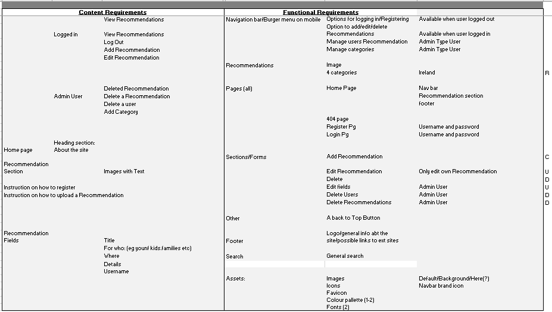
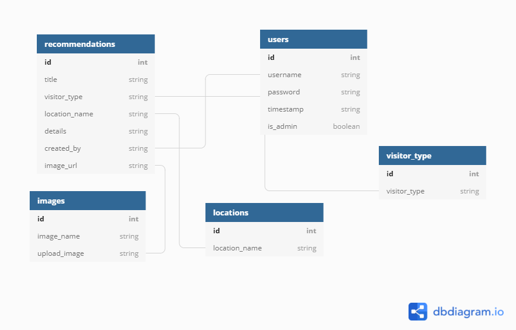

# [Hidden Irish Travels](xx)

Irish Hidden Travels is a site where users can share/view information/recommendations on places on the island of Ireland that others may not have heard of, but the user recommends visiting. Site was inspired by stories of friends and families about places they have accidently ‘found’, or discovered through word of mouth, while on day trips, or longer holidays around the island of Ireland.

The aim is to highlight and share information on places/things to do, that do not always appear on those “top10 places to visit lists” or get hidden way down the bottom of a google search. Site is aiming to encourage people living and visiting the Island of Ireland, to experience, discover and tell others about these places in a positive and helpful way. 

(Link to live Site)[https://hiddenirishtravels.herokuapp.com/]
## **To open any links in a new tab, please press Ctrl + click**

## Table of Contents

- [UX](#ux)
  - [External User Goals](#external-user-goals)
  - [Site Owner Goals](#site-owner-goals)
  - [Strategy and Scope](#strategy-and-scope)
  - [Structure](#structure-of-the-website)
  - [Wireframes](#wireframes)
  - [Surface](#surface)
    - [Colors](#colors)
    - [Typography](#typography)
    - [Images](#images)
	- [DB Schema](#dbschema)
    - [Features](#features)	
- [Technologies](#technologies-used)
- [Testing](#testing)
- [Deployment](#deployment)
    - [SetUp](#set-up)
    - [Heroku Deployment](#deployment-to-heroku)
    - [Run repo locally](#download-and-run-repo-locally)
    - [Cloning the repo](#cloning-the-repo)
    - [Forking the repo](#forking-the-repo)
- [Credits](#credits)

---

## UX

### External User goals

#### As a first-time user, I want to

- Understand the main purpose of the site.
- View recommended places in Ireland and Northern Ireland.
- Register as a user
- Find out how to submit a recommendation
- Be able to view the site on mobile/desktop/tablet.
- Be able to access all pages and navigate without confusion, without too many clicks.

#### As a returning user, I want to

- View recommended places in Ireland and Northern Ireland.
- Log-In
- Submit a new recommendation
- Edit a previously submitted recommendation
- Delete a previous recommendation
- Be able to view the site on mobile/desktop/tablet.
- Be able to access all pages and navigate without confusion, without too many clicks.
- Search based on a key word

### Site Owner goals

#### As site owner I want to

- Provide a place for users to recommend unusual and unknown places to see on the island of Ireland.
- Manage categories
- Update/add own personal recommendations
- Delete negative and misleading recommendations.
- Delete Users.

### Strategy and scope

The main goal of the site is to provide user with a site where they can find recommendations from others, on unusual or unknown places on the island of Ireland. Eg places the user may not have been aware. Users will not need to be registered to view the recommendations but will have to do so, in order to upload a review. 
To convert a visitor, and draw them in, there will be a short explanation of the site with some examples of unique and interesting places to visit.  Emphasis is on positivity on the site, this is a place for users to let others know about places they have perhaps stumbled that they have enjoyed and found interesting, but maybe had never heard of before.

[Strategy and scope tables](README-assets/scope-table-ms3.PNG)

### Structure of the website

The basic structure of the site is designed around making it easy for the user to navigate and view/upload recommendations. A user will land on the home page where they can view recommendations and use a simple process to register/login in order to manage their recommendations. Recommendation form will have 4 Fields for the user to update, 2 of which will be dropdown boxes. Username will be updated from the user profile.

Standard form will be used for new reviews/editing/deleting for all users and admin. Login and registration forms will be as simple and clear as possible to make it easy for the user to use the site
Admin user will also have a small form to find a user and option to delete.
Logout button will also be provided

I wanted to give users the option to either upload own images or have a choice of default images. I was using cloudinary to do this but did not have the knowledge/time to implement functionality for user to upload own images. 
	- Images are stored in Cloudinary, where Admin user with the account details, can upload further images.
	- Image URL from Cloudinary is manually updated on the images collection in the DB.
	- Functionality is set up, so user can view and select image name, and this is the linked to the field for the image URL in mongo

### Wireframes

#### Final Wireframes 

[This is the final mobile wireframe](README-assets/wireframes-mobile-final.pdf)

These were built using balsamiq.

- First Wireframe I had add admin and all user-recommendations options on the menu. This was too cluttered.
Planning meeting with mentor, he advised to have these on diff levels. So I plan to have a recommendations option on main
nav bar with a lower level menu for further options. 
At the start I have admin option on the nav bar, which will bring the admin user to a Administration page. There further admin 
options will be displayed.

#### These were the original wireframes

[Mobile](README-assets/wireframe-mobile1.pdf)

[Tablet](README-assets/wireframe-tablet1.pdf)

[Desktop](README-assets/wireframe-desktop1.pdf)

### Surface

#### Includes some design decision made during development

- Search: Word shown on vertical drop down for mobile/tablet but too cluttered on desktop menu. Use a search icon instead
- Originally did not have a footer, but as I was going through structure and skeleton planes, I made the decision to add simple
footer, in order to have a place to give social media contacts, and for future development where email contact could be added.
- Had a what field on original scope plan, removed it. Title and deails cover what is needed on the form
- When planning out templates needed for site. Decision made to add a user_page.html to site. This will covers instances where a user has more than 1 recommendation
They will all open on this one page.
Page also to be used for admin to see all users recommendations, and admin can delete from there
- Have set a background colour on the card reveal. Use the color picker to change from the root irish green to another shde.
Wanted the card reveal to stand out from the page as a whole
- Change manage form details from collection to table. Was a better layout for UX

I removed text on home and user page buttons, just using icons
Changed top image on home and user pages, and reset css properties to ensure images displaying without stretching on all screens.
Decided to leave background on forms as whote, contrasts with background on main pages.

#### Colors

I wanted to use green colour associate with Ireland so chose the hex value of the green on the irish flag. Use a dark colour for text, making it easily accessible and a light calming blue colour. All colours will be tested for accessibility/contrast/

Simple colour scheme containing 3 main colours:
	- 172a3a/169b62/edf6f9			
    | A dark color for txt/ Irish green for small elements /  light blue colour for overall visual |

When checking contrast on the pages, I had some contrast errors.
Changed colour of text on navbar, text on cards to the root main text colour. 
Used the color picker to choose darker colors for footer icons and inoput labels. This cleared all the contrast errors

#### Typography

There will be two fonts used throughout the website. The titles font will be Hind, and the accompanying body font will be Poppins. Fallback fonts for both are san-serif
I feel these fonts are easy for user to read on screen and are visually appealing.

#### Images

Images were mainly taken from unsplash.com and saved to cloudinary. I had used 2 images on home and user pages and was trying to achive a parallax effect. Thsi worked but 
the images were not appearing well on screen.
Final decision was to change the images used on home and user pages and removed the fixed bg css prop. Dont have parallax but looks and scales better. Used object position to place for different sizes

#### DB Schema

DB has five collections. The main two are for the users and the recommendation details. Images, visitor types and locations are held in their own seperate collections. 
These are the fields on the form, that a user can select from predefined options

[Back to table of contents](#table-of-contents)

## Features

**_Website has the following features_**

### Features which are accessible on all pages with the exception of error pages.

#### Navigation Menu. 

- Contains links to:

| Logged Out | Logged In	|
|------------|-----------------	|
|  Home	     | Home       	|
|  Log In    | Recommendations  |
|  Register  |  Admin * 		|
|  	     | Log Out  	|
|  	     |   		|

| Recommendations Menu| 
|---------------------|
|  Add New	      | 
|  User page  	      | 
|  	      | 

** Admin option will bring the user to the overall Admin  page, where user can access the admin functionality
** The Admin option is restricted and regular user will not have access

- Navbar is collapsible icon on medium and small screens, and will display as vertical menu when clicked
- Search will display as an icon on desktop

#### Footer

- Contains copyright and social info
#### Icon
- Arrows Up to click to go to top of page.
- icon in nav bar, Brings user to home page

#### Flash Messages
- Display under nav bar. Cancel icon to clear it, will fade out so that user will not have to refresh pg

### Features on individual pages

#### Home Page

Contains the following:

- Logged Out User 
	- Navigation Menu with options to login and register	
	- Recommendations section	
	- Footer

- Logged In User (Regular and Admin)
	- Navigation Menu	
	- Add new button
	- Home page link
	- Add Recommendations link
	- Search Option
	- Recommendations section
	- Button to click to go to top of page.
	- Footer

#### Registration Page

Contains the following:

- Navigation Menu
- Header and modal with info on registration
- Registration Form with 3 input fields and submit button
	- username
	- password
	- password confirmation
	- Submit button to register
- Link to login page
- Footer

#### Log In Page

Contains the following:

- Navigation Menu
- Log In Form with 2 input fields and submit button
	- username
	- password
	- Log In button
- Footer

#### Users personal Page

Contains the following:

- Navigation Menu
- Add New Option : Blank Recommendation form opens
- Home Page Button
- Modal with more info
- Search Option
- Button to click to go to top of page.
- Footer

- Recommendations section:- Only those displayed by user can be viewed.
	- Each will give user options to edit or delete
		- If Edit Option was selected: Prepopulated form is shown with Edit button. **Restrict to username
		- If Delete Option was selected: Prepopulated form is shown with delete button.    **Restrict to username and show confirmation btn

#### Recommendation Form:

#### Add New
	- dropdown list of images to select from
	- Title, Details are free form text input for users
	- 2 fields for user to select from dropdown. Visitor type and locations
	- Submit Button/Clear form
	- Back to user page Option

#### Edit 
	- Image 
		On Edit, user can select to change
	- 2 user input fields: title and details.
		On Edit, fields user can click on fields to edit
	- 2 fields for user to select from dropdown. Visitor tyoe and locations
		On Edit, user can select to change
	- Edit Button/Cancel/Back buttons

#### Displayed on Home and User pages

Recommendation form and card reveal displayed on Home and user pages.
User has access to edit and delete on their own page.
	- Card showing image, title, location, start of details
	- Reveal shows all details and created by field

#### Admin Overview Page

Contains the following:

- Navigation Menu
- Button to open page to upload to cloud
- Button to open Manage Visitor and Location page
- button to open page to delete user recommendations
- Button to open page to Delete users
- Section containing modal triggers, for more info on all admin options
- Footer

#### Upload to Cloudinary Page

- Navigation Menu
- Section containing instructions
- Cloudinary upload widget
- Footer

#### Admin Add/Edit Fields Page

Contains the following:

- Navigation Menu
- Admin Username as heading
- Recommendation Form:
	- current fields on display
- Add New button
	- will display form with key:value details to be input and button confirmation
- Edit button: allow Admin user to click on a field to edit
- Cancel button
- Footer

#### Admin Delete Recommendation Page

** Note: Admin should only be able to delete a users recommendation, not edit it.
Contains the following:

- Navigation Menu
- Admin Username as heading
- Form with the following fields:
	- Find recommendation (*using _id or how??)
	- Details
	- Reason for deletion (admin could keep screenshots as back up to confirm reasons)
- Delete button
- Cancel button
- Footer

#### Admin Delete User Page

Contains the following:

- Navigation Menu
- Admin Username as heading
- Form with the following fields:
	- Find username
	- User details
	- Reason for deletion (admin could keep screenshots as back up to confirm reasons)
- Delete button
- Cancel button
- Footer

#### Logout 

This is an app route. Option in Nav Bar.
Flash message to user

## Future Features

- User can upload own images
- Automate updating uploaded image URLs
- Email contact
- Email verfication on registration
- Change password fucntionality
- Ranking/Likes
- Map showing places recommended
- Individual alt attribures on uploaded images
- Admin could have an option to change a field, and it would auto update the recommendations displayed.
- Filter field types on admin manage form page

[Back to table of contents](#table-of-contents)

## Defensive Design 

The following are defensive design elements identified in planning. Each will be manually tested (See testing docs)

- Non registered User should not be able to do the following:
  - Add/Edit/Delete a recommendation
  - Search site
  - View 'logged in' menu bar
  - View or access any admin options

- Error pages should be in place. 404

- Regular logged in user should not be able to do the following
  - View 'logged out' menu bar
  - View Admin Option in nav bar
  - View Admin Overview page
  - View or action any admin functionality: Edit fields/delete recommendations (other than own)/Delete a user

- Back buttons/Home buttons or other navigation buttons should bring user back to the appropriate page, depending on their logged in/Out status

- Form validation needs to be in place

- If Admin deletes a user, how does this affect active recommendations.	Recommendation remains on the Home page as displayed. Data held in a deperate collection on the DB. Cannot be edited
		
- If Admin deletes/edits fields, how does this affect active recommendations. 
		
*** Abuse of Admin privileges, controls on this and info security need to be in place as part of the business process ***

## Technologies Used

- HTML5 - Programming language for structuring the site.
- CSS3- Style sheet programming language
- Python3, Jinja templating language & Flask microframework
- [Github](https://github.com/)- software hosting platform to keep project in a remote location
- [Gitpod](https://gitpod.io/) - a development hosting platform
- Git - used for version-control.
- [Google fonts](https://fonts.google.com/) -used to select and provide typography.
- [Online kanban tool for plan and management of project tasks](https://kanbantool.com/)
- [Balsamiq](https://balsamiq.com/) - used to build wireframes. Downloaded software to use.
- [Markdown table convert](https://tableconvert.com/) - I am using this to turn data on excel into markdown table syntax
- Microsoft word and excel: to assist in organising planning for project
- [Flow chart](https://app.diagrams.net/) - Used to create a flow chart for planning of project
- [Site for creating DB schema diagrams](dbdiagram.io)
- [Site to enable me to edit pdfS](https://www.ilovepdf.com/) - I needed a tool to allow me to edit pdfs of diagrams 
- [Heroku for deployment](https://heroku.com/)
- [Site to resizing images](https://resizeimage.net/)
- [Favicon generator - website planet](https://www.websiteplanet.com/webtools/favicon-generator/)
- Materializecss
- Cloudinary for image storage
- Mongodb Database
- Tinyjpeg to compress images
- Fontawesome & google fonts
- [techsini for mock-ups](https://techsini.com/multi-mockup/index.php)
- Validators:
  - jshint
  - validator.w3.org
  - jigsaw.w3.org/css-validator
  - pep8online.com
- [Site for CSS animations](https://animate.style/.)
- [techsini for mock-ups](https://techsini.com/multi-mockup/index.php)
- WAVE extension for reviewing accessibility and colour contrasts in testing.
- Chrome Dev Tools - used to view responsiveness and layout as site was being developed. I found this very useful when developing the site, as it aided my learning throughout the project.
- BIRME.net for resizing images in bulk

[Back to table of contents](#table-of-contents)

## Testing

[Testing Documentation](https://github.com/LisaHackett97/HiddenIrishTravels/blob/main/TESTING.md)

- Issues during development and bugs are covered in this document, in addition to the planned testing.

## Deployment

### Set up:

1) Some requirements
- git
- python3
- pip3 to install packages
- for connection with flask, run these--> pip3 install dnspython  pip3 install pymongo  
	- (*ensure these are added to the requirements.txt file)
- Flask:  install Flask-->  pip3 install flask
- MongoDb Account, with a cluster set up
- Heroku Account

2) In MongoDb, create your Database and your collections
	
3) In Gitpod, create app.py and env.py files.

4) Add env.py file to .gitignore. 

5) Connecting Flask to Mongo, will give you the URI in Mongo
	In MongoDb, within your cluster, select Overview. The click Connect button on right side.
	Select Connect to your application option
	On the next screen, ensure you have selected Python and the correct version.
	URI string will be provided. Copy/paste this to the env.py file, updating the password and DB name.
	

6) import os and set config variables in the env.py file, using os.environ.setdefault()

	a. IP			os.environ.setdefault("IP", "0.0.0.0")
	b. PORT  		os.environ.setdefault("PORT", "5000")
	c. MONGO_DBNAME  	os.environ.setdefault("MONGO_DBNAME", "*name of database*")
	d. MONGO_URI  		os.environ.setdefault("IP", "*paste the str copied from mongo, update password and db name")
	d. SECRET_KEY 		os.environ.setdefault("IP", "*unique secret key")

7) In the app.py file, set up imports, flask and other required variables:
	- note using an if statment to import the env.py, will create the __pycache__ directory, which must also be added to the .gitignore file.

8) Commit and push appropriate files to Github.

### Deployment to Heroku:

1. A requirements.txt file must be in place
	Use the command-->  pip3 freeze > requirements.txt

2. Add a Procfile, so that Heroku know how to run the app
	Use the command-->  echo web: python app.py > Procfile
Ensure there are no additional blank lines in the Procfile

3. Create a new app in Heroku
	- On the dashboard, click New, and Create New app
	- Give the app a unique name (Use hyphens instead of spaces), select Region and click Create App

4. Set up environmental variables in Heroku.
	- Select Settings
	- Select Reveal Config Vars
	Add the following and their corresponding key values. Click Add after each
	- IP
	- PORT
	- MONGO_DBNAME
	- MONGO_URI
	- SECRET_KEY

**Config Variables must be set up before Automatic Deployment is put in place**

5. Set up Automatic Deployment to Github
	- Select Deploy tab
	- Choose deploy using Github. Select your repo and click connect
	- Under automatic deploy, choose master branch 
	- Click Enable automatic deploys. ***nb ensure config variables are set up before you do this)
	- Under manual deploy section, select the branch to deploy
	- Click Deploy branch
	- A message should be displayed once the app is successfully deployed
	- Click view to launch app

### To download and run locally, follow the below steps:

1. Log into GitHub and lcoate the repository.
2. Select Code
3. Click Download Zip
4. Once files have downloaded, you can extract and use cloned-project locally.

### To Clone, follow the below steps:

1. Log into GitHub and select the repository.
2. Select Code
3. Click https and copy the link
4. Open git bash
5. Change the working directory to where you want the cloned directory
6. Use command git clone and the copied URL
7. Press enter

NB: In order to work with a clone of this project, you will need to create the env.py file using your own variables and create a MongoDB database with collections. See Databas Schema section of this document for more details.
You will also need to install all of the packages listed in the requirements file you can use the following command in the terminal pip install -r requirements.txt which will do it for you.

### Forking the repository:

1. Log into GitHub and select the repository.
2. Select Fork on top right hand corner.
3. A copy should be created in your github profile and pull requests submitted.

GitHub docs link [Forking a repository](https://docs.github.com/en/desktop/contributing-and-collaborating-using-github-desktop/cloning-and-forking-repositories-from-github-desktop#forking-a-repository/)

## Credits

### Media

#### Images Used
- Ireland icon in navbar - https://www.vecteezy.com/free-vector/ireland-map

- 404 background image https://www.vecteezy.com/free-vector/nature

- Puffin image on home page: unsplash.com

- Cliffs of Moher User page: unsplash.com

- Favicon generated from (https://www.websiteplanet.com/webtools/favicon-generator/)

##### User default images

- Shamrock - https://www.vecteezy.com/free-vector/clover-pattern

- Site owners own images
	- Sunrise at the beach
	- Stormy sea
	- Mountain View
	- View frrom Crough Patrick
	-  Woods

- Unsplash.com
	- Church Interior
	- Family
	- City Street
	- Art Gallery
	- Castle Ruins
	- Old Library
	- Puffins

#### Other

- I used some slide in animations on text on the 404 page. This was created from the following site. [animations](https://animate.style/)

### Content

Content for uploaded recommendations from the followings sites:
- walkni.com
- www.theirishroadtrip.com/best-places-to-visit-in-ireland/
- www.irishcentral.com/travel/travel-tips/
- www.atlasobscura.com/places/

### Colours

I used cooler.co to select inital colours. Color picker was then used to adjust as needed.

### Code

code for password confirm on registration from this post
https://stackoverflow.com/questions/21727317/how-to-check-confirm-password-field-in-form-without-reloading-page

- I followed the Code Institute task manager tutorial for the CRUD structure. I also used the JS code for the materialize validate form.

- code for filter/search box, found on a stackoverflow post. This is the link to the posters jsfiddle
 http://jsfiddle.net/JeroenSormani/xhpkfwgd/1/

- Code for back to top icon from a tutorial
// https://www.w3schools.com/howto/howto_js_scroll_to_top.asp

- Cloudinary
	- Follow this tutorial on https://cloudinary.com/blog/creating_an_api_with_python_flask_to_upload_files_to_cloudinary
	- Tutorial linked to https://github.com/rebeccapeltz/flask-cld-upload/blob/master/app.py
	- Cloudinary widget from Cloudinary documentation
	- I also read https://medium.com/@johndavidsimmons/cloudinary-api-in-flask-14018d84a314 for reference.
 
- Help with timestamp creation:  https://www.programiz.com/python-programming/datetime/strftime

### Acknowledgements

I referred to the following to add to my knowledge and for help.

- Thanks to all those who has posted on Slack in relation to Cloudinary, which was very helpful for guidance and my learning
- Code Institute course material
- Slack Community - I searched for a topic and usually someone else had the same question. This has been a great help in developing my understanding.
- And thank you to those on slock who took the time to review my project and give me feedback.
- Stackoverflow.com: Helped with finding a solution to set focus on next question button on modal
- Materialize documentation
- Thank you to my mentor Adegbenga Adeye, for his help and guidance.

[Back to table of contents](#table-of-contents)

This site was developed for Educational purposes
